# Kpmg-Virtual-Internship

This repository contains the various tasks carried out on the KPMG virtual internship by Forage.Click on view code above to access the various tasks and the code implemented.Below is a brief description of each task carried out;

## TASK 1: DATA QUALITY ASSESSMENT:
Carried out data quality assessment on the dataset from the client to find out data quality issuess and possible mitigations were done where required.

## Task 2: DATA INSIGHTS
Carried out analysis on the client datasets to generate insights that gives answers to client questions,some of the charts generated include the following;

Screenshot                                  |                Screenshot
:-----------------------------------------: | :-----------------------------------------:
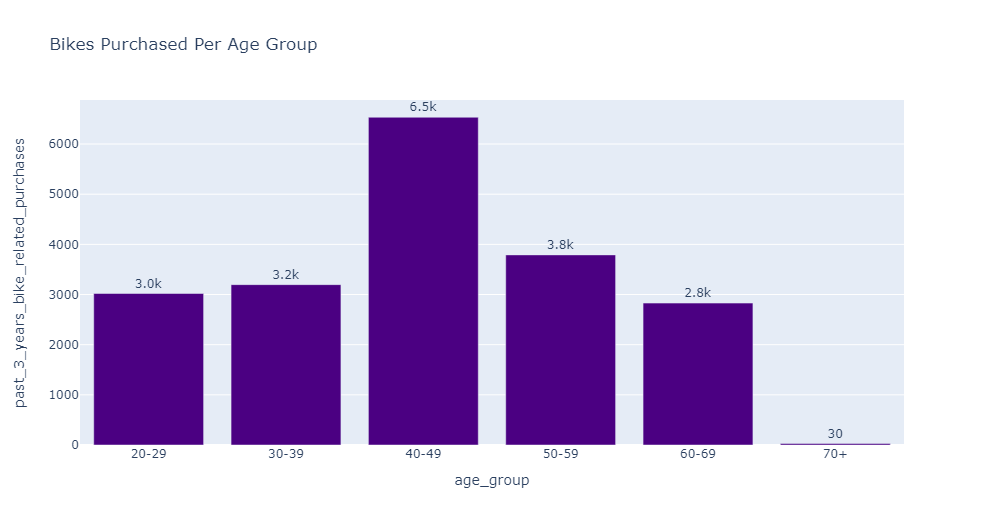                               |    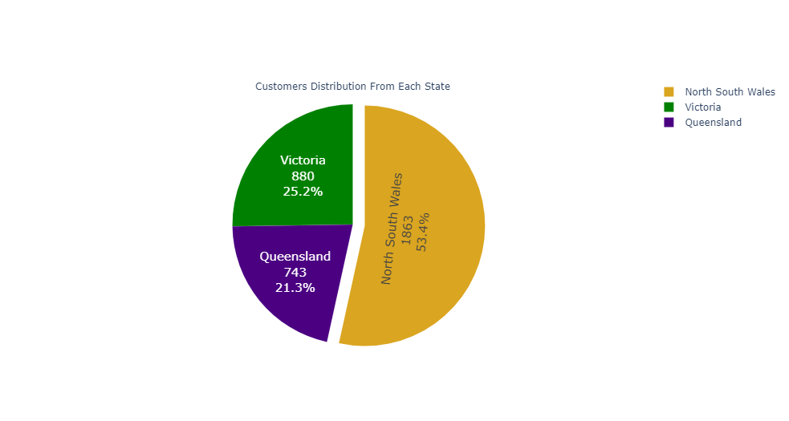

Screenshot                                  |                Screenshot
:-----------------------------------------: | :-----------------------------------------:
                               |    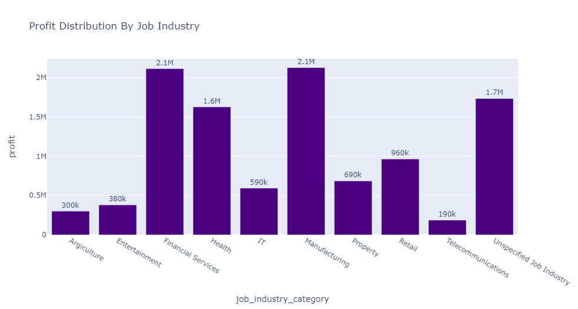

Screenshot                                  |                Screenshot
:-----------------------------------------: | :-----------------------------------------:
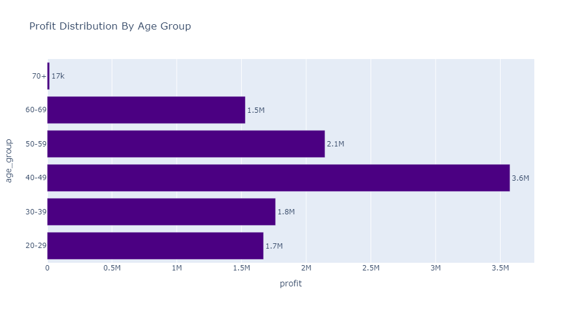                               |    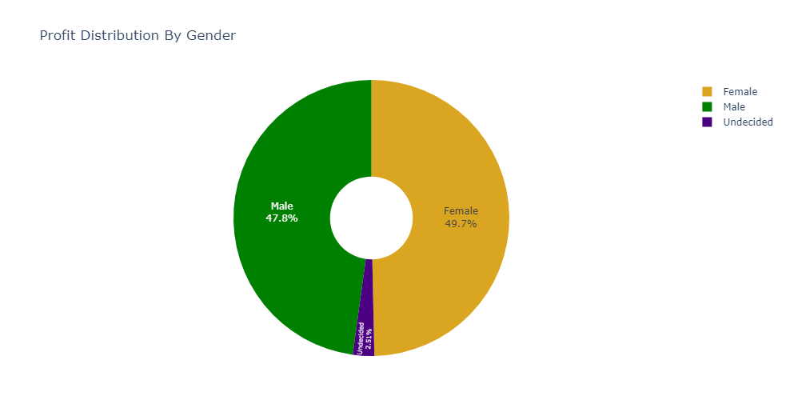

Screenshot                                  |                Screenshot
:-----------------------------------------: | :-----------------------------------------:
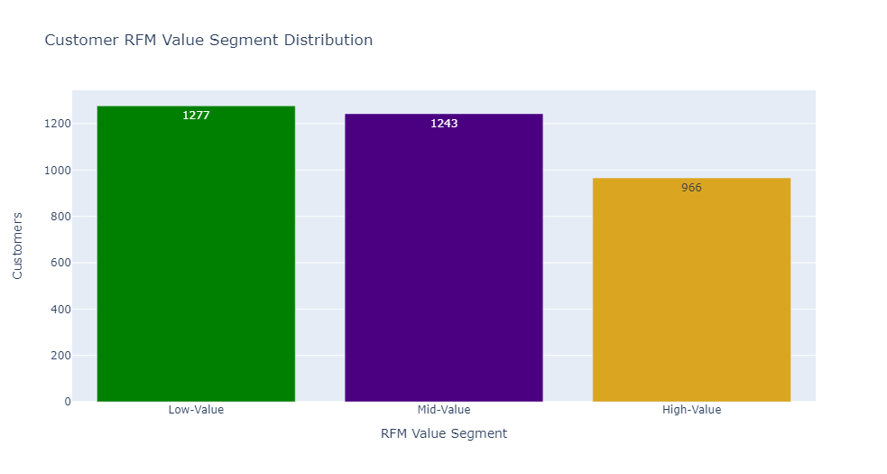                               |    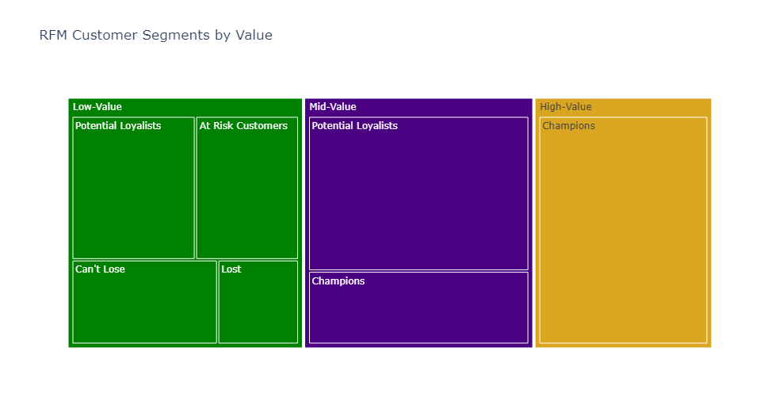

Screenshot                                  |                Screenshot
:-----------------------------------------: | :-----------------------------------------:
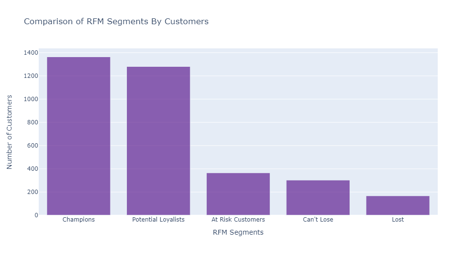                               |    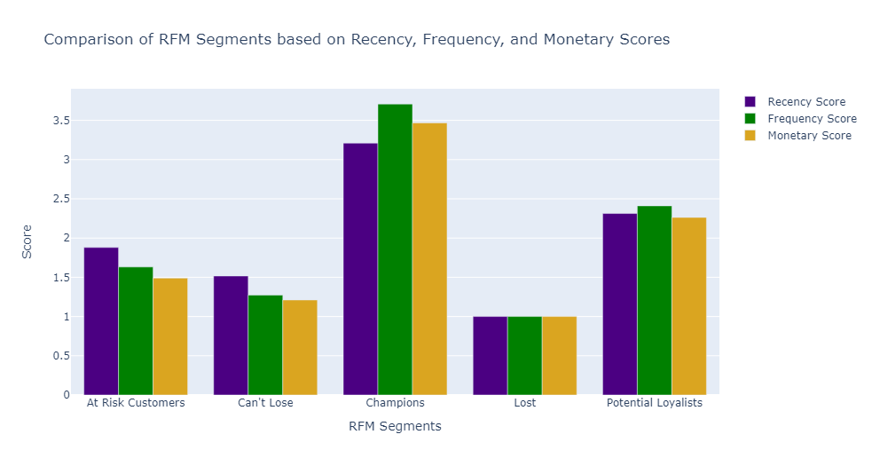

## TASK 3: DATA INSIGHTS AND PRESENTATION
Utilized Power Bi to create an interactive dashboard for client,publish it and also did a PowerPoint presentation including all of the findings and recommendations.

Screenshot                                  |                Screenshot
:-----------------------------------------: | :-----------------------------------------:
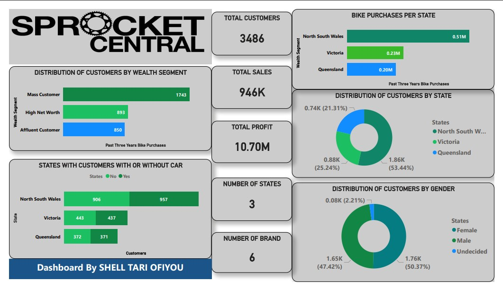             |    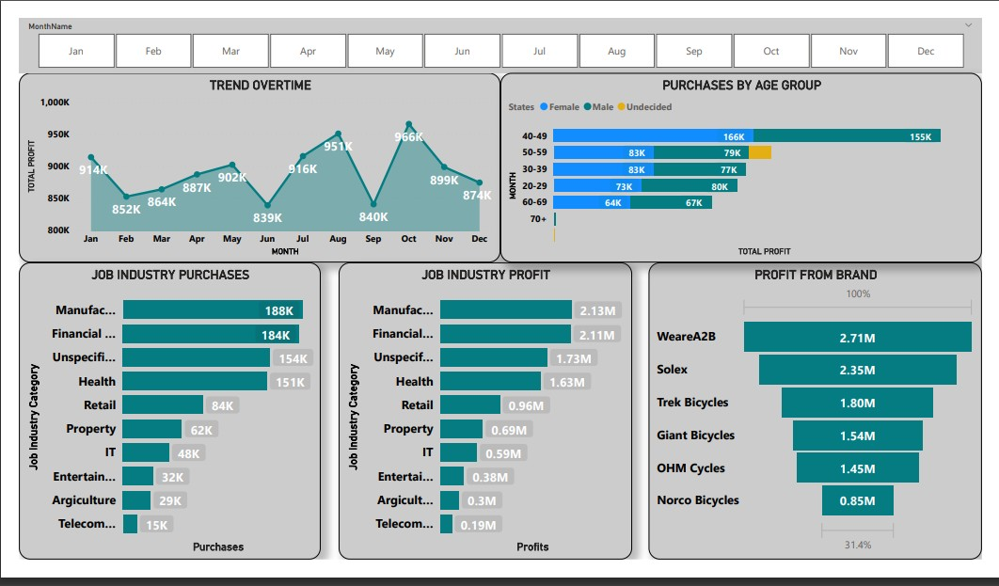

Click on link below to interact with Dashboard. 
https://app.powerbi.com/groups/me/reports/1c72faf7-a1ad-46f7-9b94-22f87d6f01fb/ReportSection?experience=power-bi
